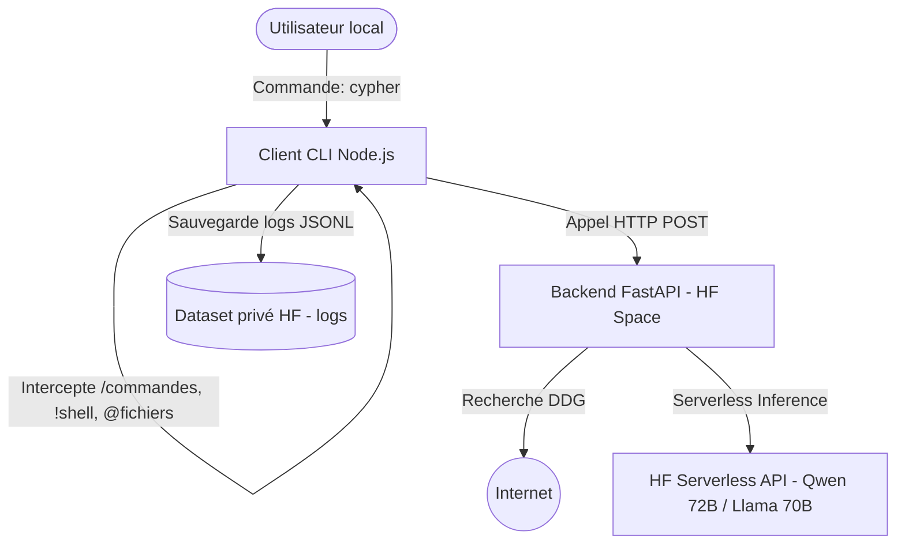

# Plan d'Implémentation - Cypher Coder CLI

Ce document présente la conception architecturale détaillée et le plan d'implémentation pour reconstruire l'outil CLI agentique **Cypher Coder** à partir de zéro dans l'espace de travail racine.

---

## 1. Diagnostic de la Version d'Origine (v1)

Après avoir inspecté le dossier initial, nous avons identifié plusieurs problèmes structurels :
- **Stratégie de Modèle Défaillante** : La v1 configurait par défaut `Qwen/Qwen2.5-Coder-7B-Instruct` sur l'API Inference Serverless de Hugging Face. Cette configuration échoue lorsque le paramètre `tools` est transmis, en raison des limitations de l'API gratuite pour ce modèle spécifique.
- **Interface Utilisateur Simpliste** : La version d'origine manquait d'un thème visuel unifié, d'une barre de statut fixe au bas du terminal, de transitions de phases dynamiques (ex: `[searching]`, `[bash]`) et de cadres de bordures arrondies Unicode premium.
- **Chargement Rigide des Commandes** : Les commandes slash étaient codées en dur et ne permettaient pas de charger des invites ou des commandes personnalisées depuis les répertoires `.cypher/commands` de l'utilisateur ou du projet.
- **Absence de Raccourcis Directs** : Pas de support pour `!` (exécution de commandes shell immédiate) ou `@` (injection de fichiers dans le contexte).

---

## 2. Recherche de Modèles Serverless Hugging Face

Conformément à la section 2.2 du cahier des charges, nous avons testé les capacités d'appels d'outils (function calling) de plusieurs modèles candidats sur l'API Inference Serverless gratuite de Hugging Face avec votre jeton `HF_TOKEN`.

### Tableau Comparatif des Modèles

| Nom du Modèle | Fournisseur | Contexte Max | Appels d'Outils | Limites Connues / Erreurs | Verdict |
| :--- | :--- | :--- | :--- | :--- | :--- |
| **`Qwen/Qwen2.5-72B-Instruct`** | Hugging Face (Défaut) | 128k tokens | **Oui** (Succès) | Limites de débit en cas de trafic intense | **Recommandé - Modèle Principal** |
| **`meta-llama/Llama-3.3-70B-Instruct`** | Hugging Face (Défaut) | 128k tokens | **Oui** (Succès) | Limites de débit en cas de trafic intense | **Recommandé - Modèle de Repli** |
| `Qwen/Qwen2.5-Coder-32B-Instruct` | Hugging Face (Défaut) | 128k tokens | **Non** (Erreur 422) | Paramètre OpenAI non supporté : `tools` | Inadapté pour l'agentic sur l'API gratuite |
| `Qwen/Qwen2.5-Coder-7B-Instruct` | Hugging Face (Défaut) | 131k tokens | **Non** (Erreur 422) | Paramètre OpenAI non supporté : `tools` | Inadapté pour l'agentic sur l'API gratuite |
| `meta-llama/Llama-3.2-3B-Instruct` | Hugging Face (Défaut) | 128k tokens | **Non** (Échec) | Ignore le paramètre tools, renvoie du texte | Inadapté pour l'exécution d'outils |

> [!IMPORTANT]
> **Découverte Majeure** : Les grands modèles d'instruction (`Qwen-72B-Instruct` et `Llama-3.3-70B-Instruct`) prennent en charge nativement le paramètre `tools` sur l'API Inference gratuite de Hugging Face. Les versions Coder renvoient quant à elles une erreur 422. Nous configurerons le serveur pour utiliser Qwen-72B en priorité avec un repli (fallback) sur Llama-3.3.

---

## 3. Architecture Proposée et Conception Système

### 3.1. Client local Node.js (`index.js` à la racine)
- **Rendu Terminal** : Utilisation d'un parseur d'entrées brut avec la bibliothèque légère `@clack/prompts` and `chalk`.
- **Menu des commandes slash** : Appuyer sur `/` ouvre instantanément un menu de sélection interactif.
- **Parseur de préfixes** :
  - `/` -> Commandes internes du CLI.
  - `@` -> Injection du contenu d'un fichier local.
  - `!` -> Exécution directe d'une commande shell locale.
- **Indicateurs de Phase Dynamiques** : Mise à jour en temps réel de l'état avec un spinner braille Unicode :
  - `[thinking]`, `[searching]`, `[reading]`, `[writing]`, `[bash]`, `[planning]`, `[reviewing]`, `[memory_sync]`.
- **Barre de statut fixe (Footer)** : Écriture de codes ANSI pour figer une barre d'informations tout en bas de l'écran du terminal.
- **Cadres et Diffs** : Dessin de bordures arrondies pour afficher les résultats de commandes et les différences de fichiers (`diffs` colorés vert/rouge).
- **Chargeur de commandes personnalisées** : Analyse des dossiers `~/.cypher/commands/` and `./.cypher/commands/`.

### 3.2. Backend (FastAPI dans votre Space Hugging Face)
- **Orchestration des outils** : Gestion de la boucle d'agent côté serveur.
- **Recherche DuckDuckGo** : Résolution de l'outil `search_web` sur le serveur et injection directe dans le contexte du modèle.
- **Règle de recherche préalable** : Consignes strictes dans le prompt système obligeant le modèle à chercher des informations (recherche web ou grep local) avant de coder.
- **Modèle de secours** : Interception des erreurs de limites de requêtes ou indisponibilités de Qwen-72B pour relancer immédiatement la requête avec Llama-3.3.

### 3.3. Mémoire de Dataset (HF Dataset)
- Lecture du token depuis les variables d'environnement (`HF_TOKEN`).
- Authentification automatique pour créer, lire et écrire les historiques au format JSON dans le dataset privé `TheShellMaster/cypher-coder-logs`.
- Reprise des discussions précédentes avec `/resume`.

---

## 4. Modifications Appliquées

### 4.1. Client CLI Local
- [package.json](file:///home/theshellpc/cypher-coder/package.json) : Configuration des dépendances.
- [index.js](file:///home/theshellpc/cypher-coder/index.js) : Code principal du client interactif (barre de statut, saisie brute, cadres Unicode, etc.).

### 4.2. Backend Serveur
- [serveur/app.py](file:///home/theshellpc/cypher-coder/serveur/app.py) : Script FastAPI déployé sur Hugging Face Spaces (modèles Qwen-72B et Llama-3.3, boucle de secours et prompt système mis à jour).

### 4.3. Documentation
- [.cypher/docs/implementation_plan.md](file:///home/theshellpc/cypher-coder/.cypher/docs/implementation_plan.md) : Ce document de conception archivé dans le projet.

---

## 5. Plan de Vérification

### Validation Automatique
1. Vérification de la syntaxe des scripts locaux (`node --check index.js`).
2. Test de connectivité avec le Space Hugging Face.

### Validation Manuelle
1. Lancement du CLI via la commande globale `cypher`.
2. Vérification visuelle du rendu du footer fixe et du menu d'autocomplétion `/`.
3. Test d'injection de fichier (`@index.js`) et de commande directe (`!ls`).
4. Test d'écriture de fichier avec invite de permission et cadres de rendu.
5. Vérification de la création du fichier de log sur le dataset privé.
